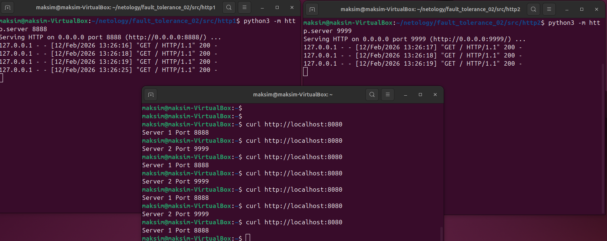
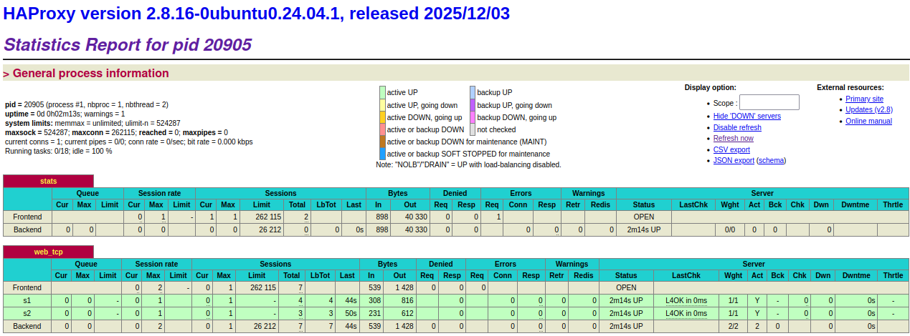
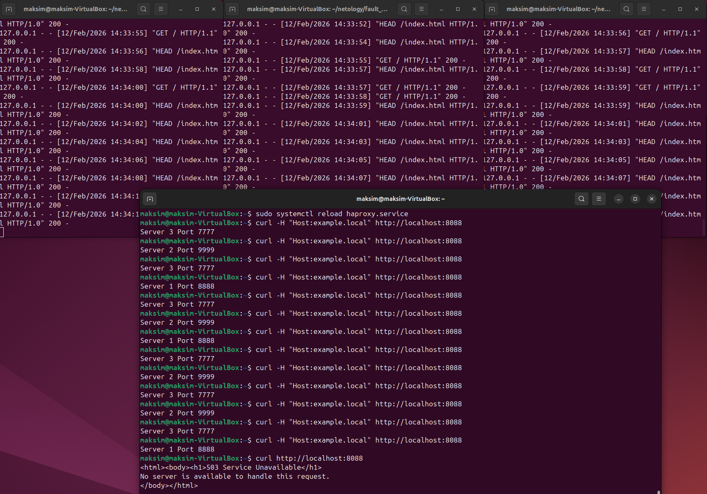
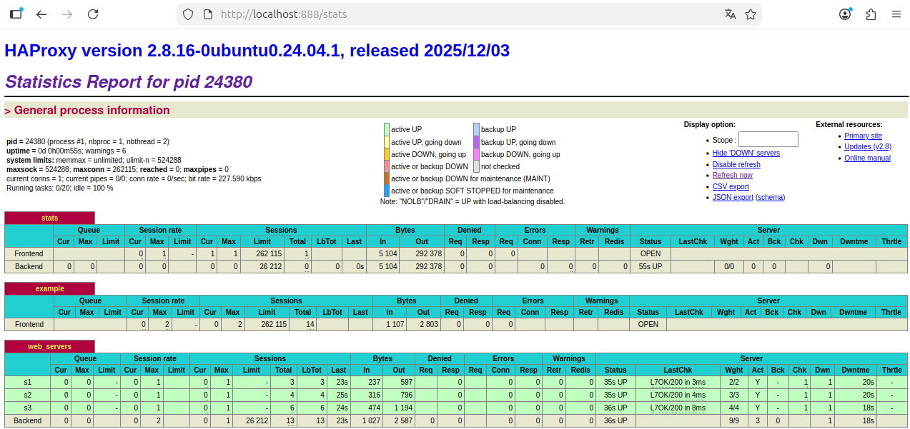
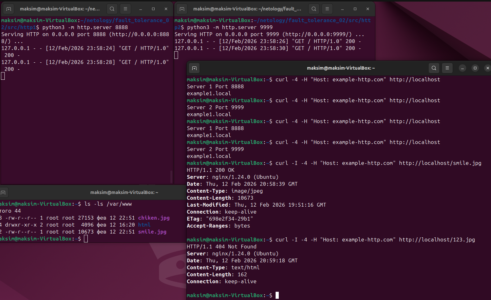
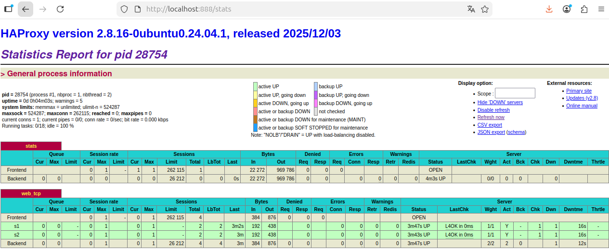

# Домашнее задание к занятию 2 «Кластеризация и балансировка нагрузки» - Клочек Максим

### Задание 1
- Запустите два simple python сервера на своей виртуальной машине на разных портах
- Установите и настройте HAProxy, воспользуйтесь материалами к лекции по [ссылке](https://github.com/netology-code/sflt-homeworks/tree/main/2)
- Настройте балансировку Round-robin на 4 уровне.
- На проверку направьте конфигурационный файл haproxy, скриншоты, где видно перенаправление запросов на разные серверы при обращении к HAProxy.

---
```bash
cd src/http1
python3 -m http.server 8888
cd src/http2
python3 -m http.server 9999
sudo apt update
sudo apt install haproxy 
sudo nano /etc/haproxy/haproxy.cfg
sudo systemctl reload haproxy.service 
curl http://localhost:8080
```

Добавить в /etc/haproxy/haproxy.cfg
```
listen stats  # веб-страница со статистикой
        bind                    :888
        mode                    http
        stats                   enable
        stats uri               /stats
        stats refresh           5s
        stats realm             Haproxy\ Statistics

listen web_tcp
	mode tcp
	bind :8080
	balance roundrobin
	server s1 127.0.0.1:8888 check inter 3s
	server s2 127.0.0.1:9999 check inter 3s
```

Результат



---

### Задание 2
- Запустите три simple python сервера на своей виртуальной машине на разных портах
- Настройте балансировку Weighted Round Robin на 7 уровне, чтобы первый сервер имел вес 2, второй - 3, а третий - 4
- HAproxy должен балансировать только тот http-трафик, который адресован домену example.local
- На проверку направьте конфигурационный файл haproxy, скриншоты, где видно перенаправление запросов на разные серверы при обращении к HAProxy c использованием домена example.local и без него.

---

Конфиг `/etc/haproxy/haproxy.cfg` должен содержать
``` 
listen stats  # веб-страница со статистикой
        bind                    :888
        mode                    http
        stats                   enable
        stats uri               /stats
        stats refresh           5s
        stats realm             Haproxy\ Statistics

frontend example  # секция фронтенд
        mode http
        bind :8088
        acl ACL_example.local hdr(host) -i example.local
        use_backend web_servers if ACL_example.local

backend web_servers    # секция бэкенд
        mode http
        balance roundrobin
        option httpchk
        http-check send meth HEAD uri /index.html
        server s1 127.0.0.1:8888 check weight 2
        server s2 127.0.0.1:9999 check weight 3
        server s3 127.0.0.1:7777 check weight 4
```
Резутьтат



---

## Задания со звёздочкой*
Эти задания дополнительные. Их можно не выполнять. На зачёт это не повлияет. Вы можете их выполнить, если хотите глубже разобраться в материале.

---

### Задание 3*
- Настройте связку HAProxy + Nginx как было показано на лекции.
- Настройте Nginx так, чтобы файлы .jpg выдавались самим Nginx (предварительно разместите несколько тестовых картинок в директории /var/www/), а остальные запросы переадресовывались на HAProxy, который в свою очередь переадресовывал их на два Simple Python server.
- На проверку направьте конфигурационные файлы nginx, HAProxy, скриншоты с запросами jpg картинок и других файлов на Simple Python Server, демонстрирующие корректную настройку.

---

---

### Задание 4*
- Запустите 4 simple python сервера на разных портах.
- Первые два сервера будут выдавать страницу index.html вашего сайта example1.local (в файле index.html напишите example1.local)
- Вторые два сервера будут выдавать страницу index.html вашего сайта example2.local (в файле index.html напишите example2.local)
- Настройте два бэкенда HAProxy
- Настройте фронтенд HAProxy так, чтобы в зависимости от запрашиваемого сайта example1.local или example2.local запросы перенаправлялись на разные бэкенды HAProxy
- На проверку направьте конфигурационный файл HAProxy, скриншоты, демонстрирующие запросы к разным фронтендам и ответам от разных бэкендов.

---
Конфиг `/etc/haproxy/haproxy.cfg` должен содержать
```
listen stats  # веб-страница со статистикой
        bind                    :888
        mode                    http
        stats                   enable
        stats uri               /stats
        stats refresh           5s
        stats realm             Haproxy\ Statistics

frontend example  # секция фронтенд
        mode http
        bind :8088
        acl ACL_example1.local hdr(host) -i example1.local
        acl ACL_example2.local hdr(host) -i example2.local
        use_backend web_servers1 if ACL_example1.local
        use_backend web_servers2 if ACL_example2.local

backend web_servers1    # секция бэкенд
        mode http
        balance roundrobin
        option httpchk
        http-check send meth HEAD uri /index.html
        server s1 127.0.0.1:8888 check inter 8s
        server s2 127.0.0.1:9999 check inter 8s

backend web_servers2    # секция бэкенд
        mode http
        balance roundrobin
        option httpchk
        http-check send meth HEAD uri /index.html
        server s3 127.0.0.1:7777 check inter 8s
        server s4 127.0.0.1:6666 check inter 8s
```

Резутьтат




---
